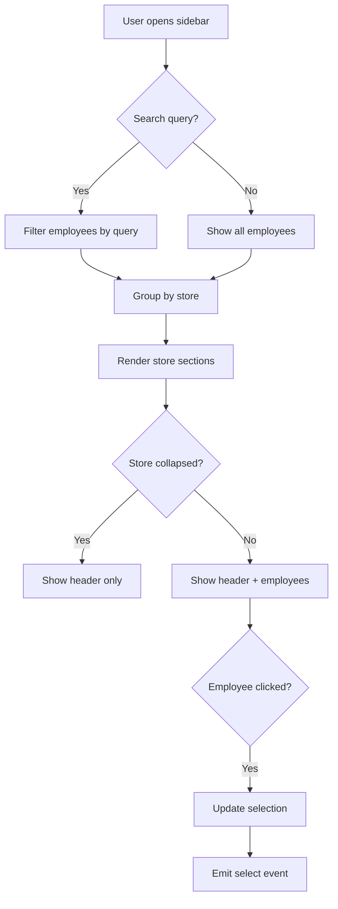

# Sidebar Redesign Plan - Minimal & Clean Style

## Design Direction
Inspired by **Linear** and **Notion** - focusing on:
- Generous whitespace
- Subtle borders and dividers
- Simple, refined icons
- Clear visual hierarchy
- Smooth micro-interactions

---

## Current Issues

| Issue | Impact |
|-------|--------|
| Dense layout with visual noise | Hard to scan quickly |
| No search/filter | Difficult to find employees in large lists |
| Basic avatar design | Lacks personality |
| Store headers blend with items | Poor visual hierarchy |
| Missing hover micro-interactions | Feels static |
| Footer feels disconnected | Breaks visual flow |

---

## Proposed Design Changes

### 1. Layout Structure

```
┌─────────────────────────────┐
│  🔍 Search input            │  ← Sticky search
├─────────────────────────────┤
│                             │
│  ▼ Store Name (3)           │  ← Collapsible sections
│    ○ Employee 1             │
│    ○ Employee 2             │
│    ○ Employee 3             │
│                             │
│  ▼ Store Name (2)           │
│    ○ Employee 4             │
│    ○ Employee 5             │
│                             │
├─────────────────────────────┤
│  12 employees • 3 stores    │  ← Subtle footer
└─────────────────────────────┘
```

### 2. Component Hierarchy

```
EmployeeSidebar.vue
├── SidebarHeader (search + collapse toggle)
├── SidebarContent
│   ├── StoreSection (collapsible)
│   │   ├── StoreSectionHeader
│   │   └── EmployeeList
│   │       └── EmployeeItem
│   └── EmptyState
└── SidebarFooter
```

### 3. Visual Design Specifications

#### Colors (using existing theme)
- **Background**: `ink-deep` (#1c1c1c)
- **Surface hover**: `ink-lighter` (#323230)
- **Selected state**: `vermillion-500/8` with left accent border
- **Text primary**: `paper-white` (#F2ECE2)
- **Text secondary**: `paper-muted` (#8A7F72)
- **Borders**: `border-subtle` (#373736) at 50% opacity

#### Typography
- **Section headers**: 11px, uppercase, letter-spacing 0.05em, `paper-muted`
- **Employee names**: 14px, medium weight, `paper-white`
- **Role badges**: 10px, subtle background, rounded-full

#### Spacing
- **Sidebar padding**: 12px
- **Section gap**: 24px
- **Item padding**: 10px 12px
- **Item gap**: 2px

### 4. New Features

#### Search Functionality
```typescript
// Composable: useEmployeeSearch.ts
const searchQuery = ref('')
const filteredEmployees = computed(() => {
  if (!searchQuery.value) return employees.value
  const query = searchQuery.value.toLowerCase()
  return employees.value.filter(emp =>
    emp.displayName.toLowerCase().includes(query) ||
    emp.stores.some(s => s.toLowerCase().includes(query))
  )
})
```

#### Collapsible Store Sections
- Store sections can be collapsed/expanded
- State persisted in localStorage
- Smooth height animation

#### Keyboard Navigation
- Arrow keys to navigate list
- Enter to select
- Escape to clear search
- `/` to focus search

### 5. Micro-interactions

| Element | Interaction | Animation |
|---------|-------------|-----------|
| Employee item hover | Background fade | 150ms ease |
| Employee item select | Left border slide in | 200ms ease-out |
| Store section toggle | Chevron rotate + content collapse | 200ms ease |
| Search focus | Border color change | 150ms ease |
| Avatar hover | Subtle scale | 150ms ease |

### 6. Accessibility Improvements

- Proper ARIA labels for all interactive elements
- Focus visible states with ring
- Screen reader announcements for selection changes
- Keyboard navigation support
- Reduced motion support

---

## Implementation Steps

### Phase 1: Structure Refactor
1. Create `useEmployeeSearch` composable
2. Add search input component to header
3. Implement collapsible store sections
4. Update employee item styling

### Phase 2: Visual Polish
1. Apply new spacing and typography
2. Add hover/focus states
3. Implement selection animation
4. Add smooth transitions

### Phase 3: UX Enhancements
1. Add keyboard navigation
2. Implement localStorage persistence for collapsed sections
3. Add empty search state
4. Add loading skeleton

---

## Component Code Structure

### EmployeeSidebar.vue (Updated)

```vue
<script setup lang="ts">
// ... imports

const searchQuery = ref('')
const collapsedStores = useLocalStorage<string[]>('sidebar-collapsed-stores', [])

const filteredEmployeesByStore = computed(() => {
  // Filter logic here
})

const toggleStoreCollapse = (storeName: string) => {
  const index = collapsedStores.value.indexOf(storeName)
  if (index > -1) {
    collapsedStores.value.splice(index, 1)
  } else {
    collapsedStores.value.push(storeName)
  }
}
</script>

<template>
  <aside class="sidebar">
    <!-- Search Header -->
    <div class="sidebar-header">
      <div class="search-wrapper">
        <SearchIcon class="search-icon" />
        <input
          v-model="searchQuery"
          type="text"
          placeholder="Tìm nhân viên..."
          class="search-input"
        />
        <kbd v-if="!searchQuery" class="search-shortcut">/</kbd>
      </div>
    </div>

    <!-- Content -->
    <div class="sidebar-content">
      <template v-for="[storeName, employees] in filteredEmployeesByStore">
        <div class="store-section">
          <button
            class="store-header"
            @click="toggleStoreCollapse(storeName)"
          >
            <ChevronIcon :direction="collapsedStores.includes(storeName) ? 'right' : 'down'" />
            <span class="store-name">{{ storeName }}</span>
            <span class="store-count">{{ employees.length }}</span>
          </button>

          <div v-show="!collapsedStores.includes(storeName)" class="employee-list">
            <button
              v-for="emp in employees"
              :key="emp.id"
              class="employee-item"
              :class="{ selected: selectedId === emp.id }"
              @click="selectEmployee(emp)"
            >
              <div class="employee-avatar">
                {{ emp.displayName.charAt(0) }}
              </div>
              <div class="employee-info">
                <span class="employee-name">{{ emp.displayName }}</span>
                <span class="employee-role">{{ getRoleDisplay(emp.role) }}</span>
              </div>
            </button>
          </div>
        </div>
      </template>
    </div>

    <!-- Footer -->
    <div class="sidebar-footer">
      <span>{{ totalEmployees }} nhân viên</span>
      <span>{{ totalStores }} cửa hàng</span>
    </div>
  </aside>
</template>
```

---

## Tailwind Classes Reference

### Sidebar Container
```
h-full flex flex-col bg-ink-deep border-r border-border-subtle/50
w-72 transition-[width] duration-200
```

### Search Input
```
w-full bg-transparent border border-border-subtle/50 rounded-lg
px-3 py-2 pl-9 text-sm text-paper-white placeholder:text-paper-muted
focus:outline-none focus:border-vermillion-500/50
transition-colors duration-150
```

### Store Header
```
w-full flex items-center gap-2 px-3 py-2
text-xs font-medium uppercase tracking-wider text-paper-muted
hover:text-paper-light transition-colors duration-150
```

### Employee Item
```
w-full flex items-center gap-3 px-3 py-2.5 rounded-lg
text-left transition-all duration-150
hover:bg-ink-lighter
```

### Employee Item Selected
```
bg-vermillion-500/8 border-l-2 border-vermillion-500
```

---

## Files to Modify

1. `frontend/src/components/EmployeeSidebar.vue` - Main component refactor
2. `frontend/src/composables/useEmployeeSearch.ts` - New composable (optional)
3. `frontend/src/index.css` - Add any new utility classes if needed

---

## Mermaid Diagram - Component Flow



---

## Ready for Implementation

This plan is ready to be implemented in **Code mode**. The changes focus on:

1. **Cleaner visual hierarchy** with proper spacing
2. **Search functionality** for quick employee lookup
3. **Collapsible sections** for better organization
4. **Refined interactions** with smooth animations
5. **Accessibility improvements** for keyboard users

Would you like to proceed with the implementation?
